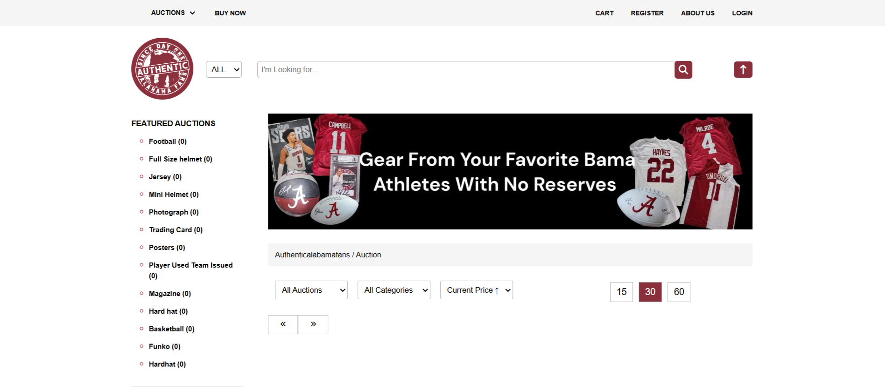
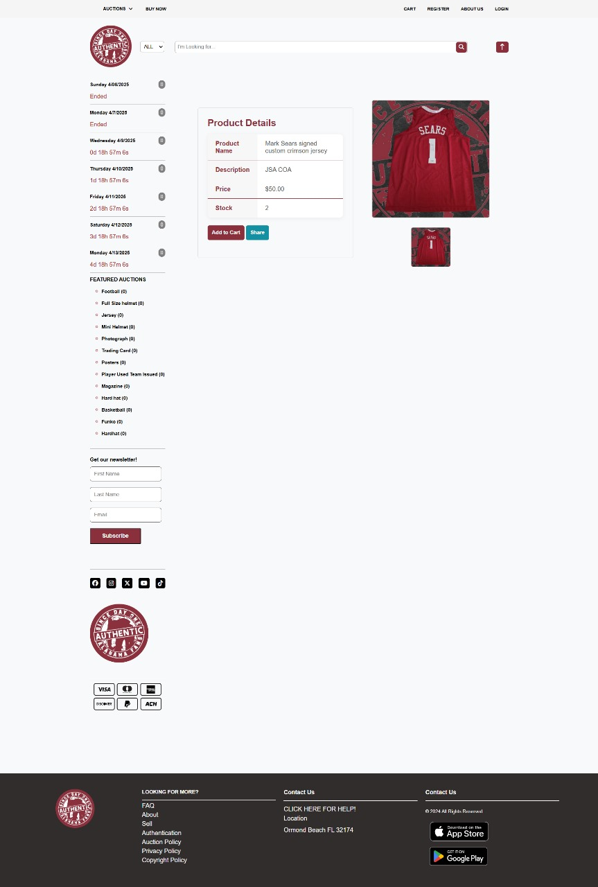
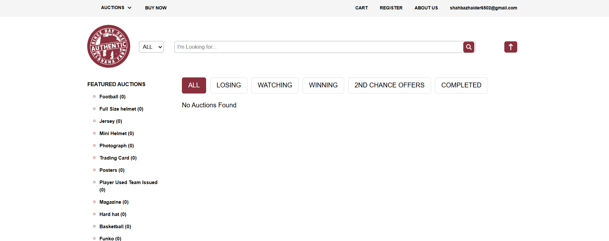
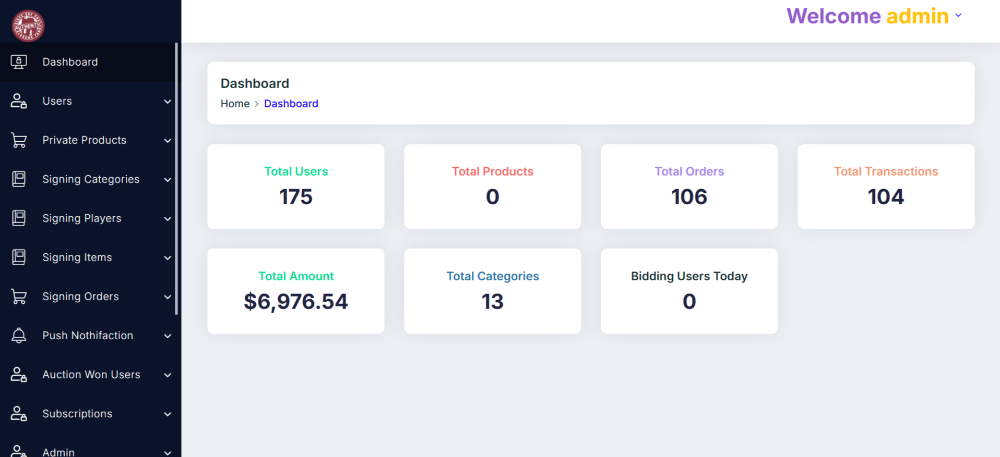

# Authentica Alabama Fans – Worldwide Auction Platform

🌐 **Live Website:** [AuthenticaAlabamaFans.com](https://authenticalabamafans.com)  
🏢 **Developed by:** Zippy Solutions – Professional Software Solutions Company  
🌍 **Portfolio:** [ZippyPK.com](https://www.zippypk.com)

---

## Overview

Authentica Alabama Fans is a **worldwide auction platform** that allows users to bid on items in real-time.  

Key highlights:  

- Users can **register, login, and participate in auctions**  
- Track ongoing bids and see the winning bid after auctions end  
- Browse a variety of auction categories and items  
- Fully responsive design for **desktop, tablet, and mobile devices**  

The platform ensures a **secure and fair bidding process** with automated bid tracking and notifications.  

---

## Features

### User Features

- Account creation and secure login  
- Browse active auctions and item listings  
- Place bids in real-time  
- View bid history and auction results  
- Track favorite items and watchlists  

### Admin Features

- Manage users and monitor bidding activity  
- Approve and manage auction listings  
- Generate analytics on bids, users, and popular items  
- Automated notifications for auction start/end events  

---

## Screenshots (Placeholder)

### Homepage
  
The homepage highlights current auctions, trending items, and categories, providing a **quick overview for users**.

### Auction Listings
  
Shows all active items with starting price, current bid, time left, and category.  

### User Dashboard
  
Allows users to **track bids**, manage favorites, and view bid history.  

### Admin Dashboard
  
Admin panel to manage auctions, users, and analytics with full control over listings and system notifications.  

---

## Tech Stack

- **Backend:** Python (Django/Flask) or PHP (Laravel)  
- **Frontend:** HTML, CSS, JavaScript, Bootstrap  
- **Database:** MySQL  
- **Realtime Bidding:** WebSockets / AJAX for live bid updates  
- **ETL & Automation:** Cron jobs for auction scheduling, notifications, and reporting  

---

## Functional Overview

1. **Real-Time Bidding** – Users place bids live, with automatic updates and tracking  
2. **Auction Management** – Admin can approve items, set auction times, and monitor activity  
3. **User Engagement** – Watchlists, notifications, and bid history for better experience  
4. **Analytics & Reporting** – Admin dashboard provides insight into top auctions and bidders  
5. **Responsive UI** – Works on all devices with fast, intuitive interfaces  

---

## Notes for Portfolio

- Project is **live and functional**; backend code is private  
- Screenshots provide a **visual walkthrough** of the platform  
- Demonstrates Zippy Solutions’ capability to deliver **complex, real-time web applications**  

---

## Quick Links

- **Live Demo:** [AuthenticaAlabamaFans.com](https://authenticalabamafans.com)  
- **Company Portfolio:** [Zippy Solutions](https://www.zippypk.com)  

---

## Summary

Authentica Alabama Fans is a **robust worldwide auction platform**, showcasing Zippy Solutions’ expertise in **real-time bidding, user dashboards, admin control, and responsive design**.  

This project demonstrates our ability to deliver:

- Real-time web applications with secure bidding  
- Full admin dashboards with analytics and controls  
- Responsive and intuitive frontend  
- Database and backend integration for complex workflows  
