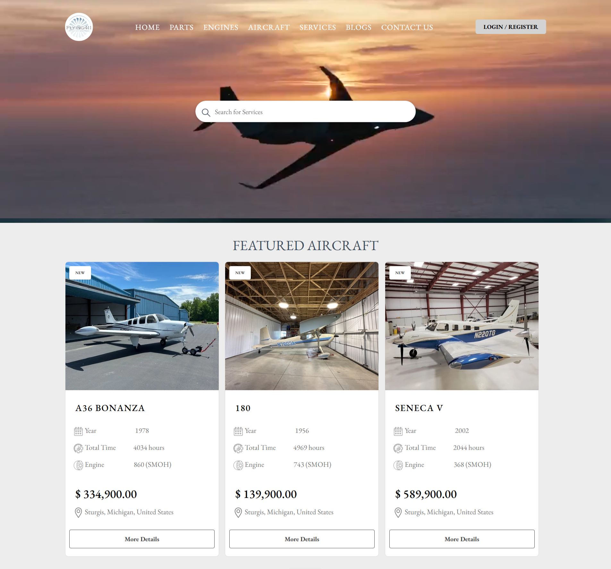
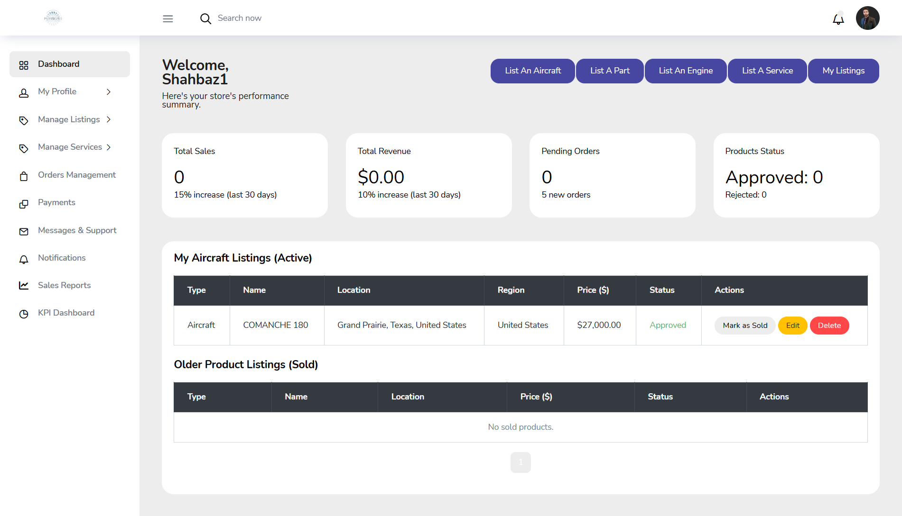
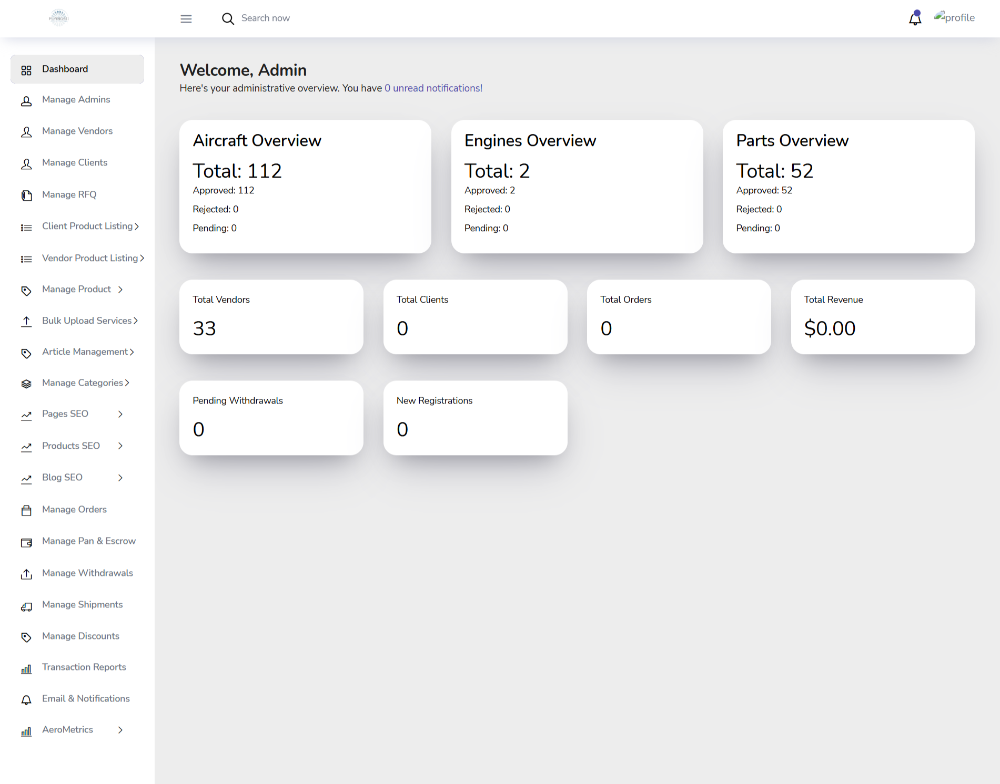

# Flying411.com – Aviation Marketplace

🌐 **Live Website:** [Visit Flying411](https://www.flying411.com)

---

## Overview

Flying411.com is a **complete aviation marketplace** connecting buyers and sellers globally.  
It allows different types of vendors to **register, create accounts, and sell**:

- Aircraft  
- Engines  
- Parts  
- Aviation services  

The platform includes a **full admin dashboard** to manage users, products, and services.  
It is **fully responsive**, working perfectly on **desktop, tablet, and mobile devices**.

---

## Features

### Vendor & User Features

- Vendor registration and login  
- Add and manage aircraft, engines, parts, and services  
- Browse listings by category, location, or type  
- Contact sellers directly  
- View detailed product/service pages with photos and specifications  

### Admin Dashboard Features

- User management (buyers & vendors)  
- Product/service approval and management  
- Category and vendor group management  
- Analytics for active listings, sales, and users  
- Easy dashboard interface with Bootstrap responsiveness  

---

## Tech Stack

- **Frontend:** HTML, CSS, JavaScript, Bootstrap, jQuery  
- **Backend:** PHP, Laravel Framework  
- **Database:** MySQL  
- Fully responsive design for all devices  

---

## Screenshots

### Homepage

### Vendor Dashboard

### Admin Dashboard

### Product/Service Listings

.png)

---

## Functional Overview

1. **Account Creation** – Users and vendors can register with email verification  
2. **Product Management** – Vendors can add, edit, and delete listings  
3. **Search & Filter** – Buyers can search by type, location, or category  
4. **Admin Controls** – Admin can manage all users, listings, categories, and approve vendor accounts  
5. **Responsive UI** – Accessible from any device, mobile-friendly, fast-loading pages  

---

## Notes for Portfolio

- This project is **live and accessible**, but the source code is private  
- Screenshots provide a **visual demonstration** of features  
- Live demo link allows visitors to explore functionality without accessing code  

---

## Quick Links

- **Live Demo:** [Flying411.com](https://www.flying411.com)  
- **Company Portfolio:** [Zippy Solutions](https://www.zippypk.com)  

---

## Summary

Flying411.com is a **robust, full-featured aviation marketplace**, showcasing our ability to deliver complex, responsive web applications with **vendor accounts, product management, and admin control**.  
This project demonstrates our expertise in **PHP, Laravel, MySQL, HTML, CSS, Bootstrap, jQuery, and responsive design**.

