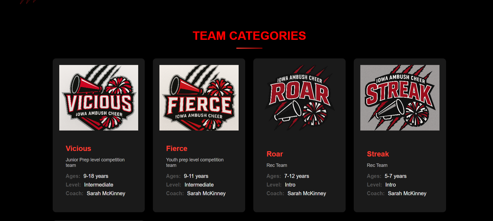
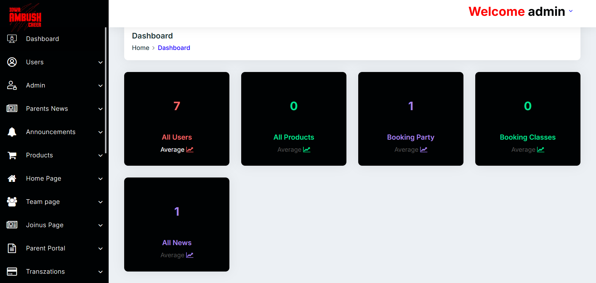

# Iowa Ambush Cheer – Cheerleading & Sports Team Platform

🌐 **Live Website:** [IowaAmbushCheer.com](https://iowaambushcheer.com/)  
🏢 **Developed by:** Zippy Solutions – Professional Software Solutions Company  
🌍 **Portfolio:** [ZippyPK.com](https://www.zippypk.com)

---

## Overview

Iowa Ambush Cheer is a **sports team and cheerleading management platform** designed to showcase teams, manage schedules, and provide news updates to fans.  

Users can:  

- View team rosters, events, and competitions  
- Follow schedules and results of cheerleading competitions  
- Access team news, announcements, and media galleries  
- Interact with content through fan engagement features  

The platform is **fully responsive**, optimized for desktop, tablet, and mobile, and provides a visually engaging interface for fans and team members.  

---

## Features

### User Features

- Browse team rosters and player profiles  
- View upcoming events and competition schedules  
- Follow news, announcements, and results  
- Access media galleries with photos and videos  
- Fan engagement features (likes, comments, favorites)  

### Admin Features

- Manage teams, rosters, and events  
- Upload media galleries and announcements  
- Publish schedules, results, and news updates  
- Analytics for team performance and fan engagement  

---

## Screenshots (Placeholder)

### Homepage
  
The homepage highlights the team, upcoming events, news, and media, providing a professional and engaging landing experience.  

### Team & Rosters
  
Detailed team rosters with player profiles, positions, and statistics.  

### User Dashboard
  
Displays upcoming competitions, results, and event details.  

### Admin Dashboard
  
Admin interface for managing teams, events, media galleries, and announcements.  

---

## Tech Stack

- **Backend:** PHP / Laravel or Python Django (depending on deployment)  
- **Frontend:** HTML, CSS, JavaScript, Bootstrap  
- **Database:** MySQL  
- **Media Management:** Galleries, images, videos  
- **Responsive Design:** Mobile-first approach for all devices  

---

## Functional Overview

1. **Team Management** – Admin manages teams, players, and rosters  
2. **Events & Competitions** – Schedules, results, and announcements tracked  
3. **Fan Engagement** – Users can follow teams, view galleries, and track results  
4. **Admin Control** – Dashboard for publishing news, managing media, and analytics  
5. **Responsive UI** – Accessible on all devices with fast and intuitive navigation  

---

## Notes for Portfolio

- Project is **live and functional**; backend code is private  
- Screenshots provide a **visual tour of features**  
- Demonstrates Zippy Solutions’ ability to create **responsive, professional team & sports management platforms**  

---

## Quick Links

- **Live Demo:** [IowaAmbushCheer.com](https://iowaambushcheer.com/)  
- **Company Portfolio:** [Zippy Solutions](https://www.zippypk.com)  

---

## Summary

Iowa Ambush Cheer showcases Zippy Solutions’ expertise in **sports team platforms**, providing:

- Full team and event management  
- Responsive web design for fans and team members  
- Admin dashboards for schedules, media, and news  
- Intuitive UI/UX for both desktop and mobile users  

This project is a **professional example** of our ability to deliver complete, engaging web applications for organizations and sports teams.
