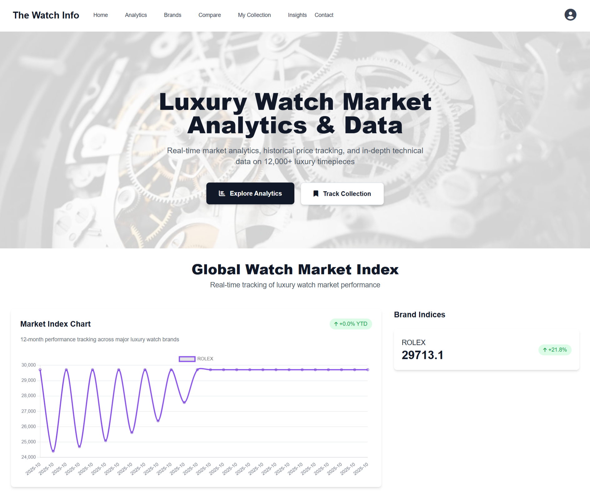

# The Watch Info – Watch Market Analytics Platform

🌐 **Live Website:** [TheWatchInfo.com](https://thewatchinfo.com)  
🏢 **Developed by:** Zippy Solutions – Professional Software Solutions Company  
🌍 **Portfolio:** [ZippyPK.com](https://www.zippypk.com)

---

## Overview

The Watch Info is a **comprehensive watch market analytics platform** that tracks trends, prices, and popular models across multiple watch marketplaces.  

Users can:

- Browse different types of watches  
- Analyze market trends and historical price data  
- Track trending brands and models  
- Build personal watch lists and mark favorites  

The platform uses **centralized data aggregation**, pulling data from multiple sources (Chrono24, Jomashop, Govberg, Bob’s Watches) and provides **actionable insights** through APIs and dashboards.  

---

## Features

### User & Analytics Features

- Browse watches with detailed specifications and pricing  
- Track **top movers**, trending brands, and popular models  
- Compare watches by model, brand, or specs  
- Build personal watch lists and save favorites  
- Interactive trend visualizations and analytics dashboards  

### Admin & Data Features

- Centralized ETL pipeline to collect and process data from multiple sources  
- Cron jobs to automate scraping and update indexes  
- API endpoints for listings, analytics, and comparisons  
- Database management for all watch listings  
- Admin dashboards to manage data sources and users  

---

## Screenshots & Professional Explanation

### 1️⃣ Homepage
  
The homepage provides a **central hub for visitors**, showing trending watches, top movers, and featured brands. It’s fully responsive and optimized for desktop, tablet, and mobile.  

---

### 2️⃣ Watch Listings
  
The listings page allows users to **browse all watches** by category, brand, or market. Each listing shows detailed specifications, price history, and seller information.  

---

### 3️⃣ User Dashboard
  
Registered users can **create personal watch lists**, track favorite models, and monitor trending watches. The dashboard provides analytics like “Price History” and “Top Movers” personalized for each user.  

---

### 4️⃣ Admin Dashboard
  
The admin dashboard is designed for **managing the entire platform**. Admins can approve listings, manage users, monitor analytics, and ensure that all data sources are synchronized correctly through ETL pipelines and automated cron jobs.  

---

## Tech Stack

- **Backend:** Python, Django/Flask (API), Scrapy (data scraping), REST API  
- **Frontend:** HTML, CSS, JavaScript, Bootstrap  
- **Database:** MySQL  
- **ETL & Automation:** Python scripts, Cron jobs, VPS deployment  
- **Data Tools:** Scrapy spiders, data pipelines, trend analysis models  

---

## Functional Overview

1. **Data Collection & Aggregation** – Centralized ETL scripts scrape watch data from multiple marketplaces.  
2. **Trend Analysis & Visualization** – Track top movers, trending brands, and price histories.  
3. **User Personalization** – Watch lists, favorites, and analytics dashboards for registered users.  
4. **Admin Management** – Full control of listings, data pipelines, and analytics through admin dashboard.  
5. **Responsive UI** – Accessible from any device, mobile-friendly, and optimized for fast performance.  

---

## Notes for Portfolio

- Live website demonstrates **full functionality and responsiveness**  
- Screenshots provide a **visual tour of features**  
- Backend code is private; only screenshots and live links are shared  
- Perfect for clients to see the **capabilities of Zippy Solutions**  

---

## Quick Links

- **Live Demo:** [TheWatchInfo.com](https://thewatchinfo.com)  
- **Company Portfolio:** [Zippy Solutions](https://www.zippypk.com)  

---

## Summary

The Watch Info showcases Zippy Solutions’ expertise in building **data-driven, responsive web applications** with scraping, ETL pipelines, REST APIs, and analytics dashboards.  

It demonstrates our ability to deliver:

- Python & Scrapy ETL pipelines  
- REST API for frontend integration  
- Admin dashboards for centralized management  
- Trend analytics and market insights  
- Fully responsive, user-friendly interfaces  
